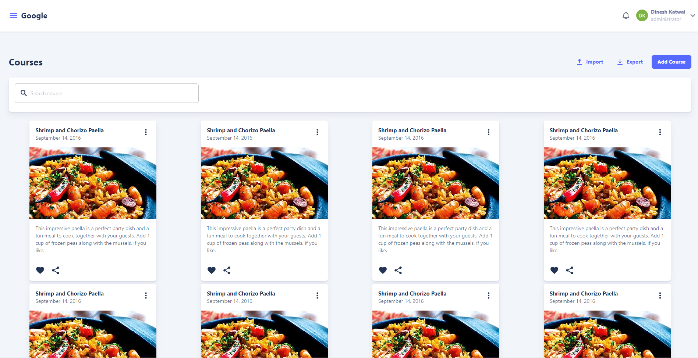

[](https://sonarcloud.io/dashboard?id=meroedu_meroedu)

[](https://sonarcloud.io/dashboard?id=meroedu_meroedu)
[](https://goreportcard.com/report/github.com/meroedu/meroedu)
# Introduction
Mero Edu is a software application for the administration, documentation, tracking, reporting, automation and delivery of educational courses, training programs, or learning and development programs.

## Getting Started

These instructions will get you a copy of the project up and running on your local machine for development and testing purposes. See deployment for notes on how to deploy the project on a live system.

[](https://merolms.io)

### Prerequisites

1. React JS 
2. Golang
3. Docker
4. Make 


## Development Stack
1. Golang
2. ReactJS
3. PostgresSql


### Running 
```
>> docker-compose up -d // For starting postgresql db with smtp server
>> make watch
```
`Then vist: http://localhost:3000`

## License
[View License](https://github.com/k2glyph/merolms/blob/master/LICENSE)
