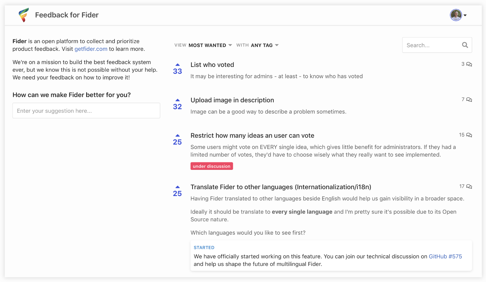

  
  <h1 align="center">Meroedu</h1>
  

    <strong>A platform to collect and organize customer feedback.</strong>
  

  
Let your customers share, vote and discuss on suggestions they have to make your product even better.

  <h3>
    <a href="https://meroedu.io">
      Website
    </a>
     | 
    <a href="https://feedback.meroedu.io/">
      See it in action
    </a>
  </h3>

  Built with ❤️ by <a href="https://github.com/goenning">Guilherme Oenning</a> and <a href="https://github.com/k2glyph/meroedu/graphs/contributors">contributors</a>

 

## Get Started

There are two options on how to get started with Meroedu

- **Self-Hosted**: You can install Meroedu on any cloud providers. There is no fee associated and you are responsible for managing it. [Learn how](https://meroedu.io/#get-started)
- **Cloud**: Cloud Meroedu is a fully managed services where you get started in minutes. Forget about managing software updates and patches, we do it all for you! [Sign up now](https://meroedu.io/#get-started)

## Contributors

This project exists thanks to all the people who contribute.

Read our [CONTRIBUTING](CONTRIBUTING.md) guide to learn how you can contribute to Meroedu.

## Sponsors

Does your organization use Meroedu? [Become a sponsor](https://opencollective.com/meroedu) and your logo will show up here with a link to your website.

## Backers

Thank you to all our backers! 🙏

Thanks to [BrowserStack](https://browserstack.com/) for providing us with free cross-browser testing for Meroedu.

